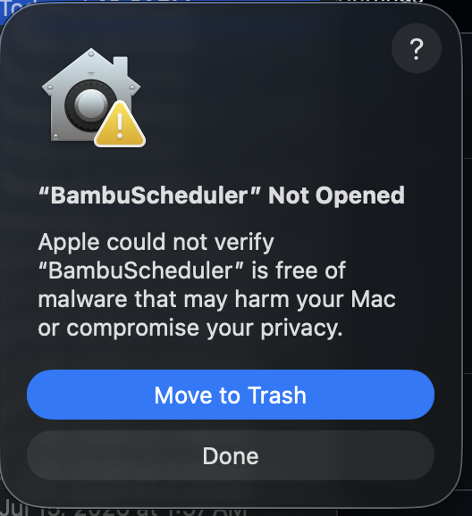
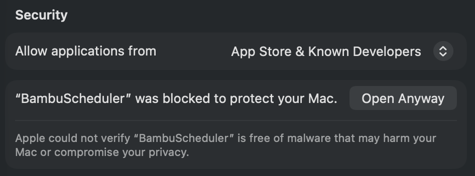
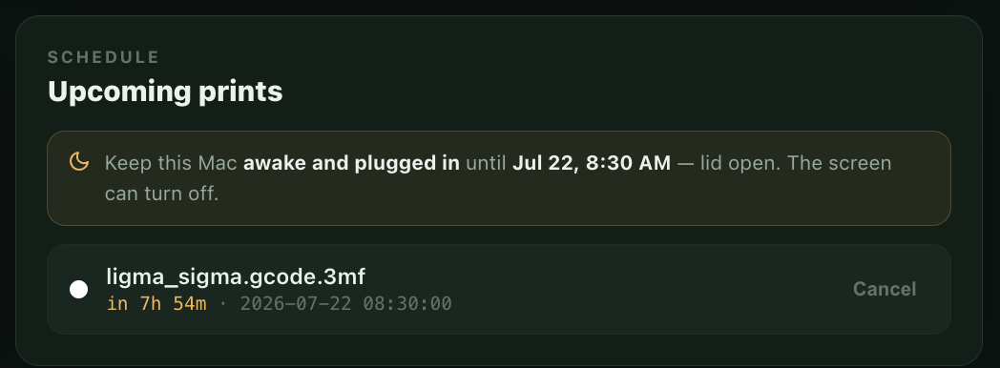
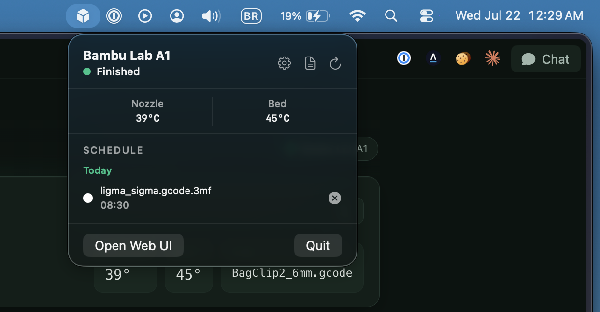

# BambuScheduler

A tiny macOS menu bar app that schedules and monitors prints on your Bambu Lab printer over your local network. **No cloud account, no subscription** — it talks straight to your printer at home.

> Want to start a print at 2 AM to catch off-peak power, or line up tomorrow's jobs tonight? Drop in a file, pick a time, done.

---

## What it does

- 🕒 **Schedule prints** for a specific date and time
- 🖨️ **Live status** — printer state, nozzle/bed temperature, and progress, right in the menu bar
- ⏯️ **Control** — pause, resume, or abort a print
- 🎨 **AMS support** — pick which filament slot to print with
- 👀 **Preview** — click a scheduled job to see the model
- 🔒 **100% local** — no Bambu cloud, no login

---

## Before you start, you'll need

- A Mac running **macOS 14 (Sonoma) or newer**
- A **Bambu Lab printer** (tested on the A1; works with X1C, P1S, and others) connected to the **same Wi‑Fi/network** as your Mac

That's it. You do **not** need to install Python or anything else — the app is self‑contained.

---

## Step 1 — Download and install

1. Go to the **[Releases page](https://github.com/brunomunizaf/BambuScheduler/releases/latest)** and download **`BambuScheduler.zip`**.
2. Double‑click the zip to unzip it. You'll get **`BambuScheduler.app`**.
3. Drag **`BambuScheduler.app`** into your **Applications** folder.

---

## Step 2 — Open it for the first time (getting past macOS security)

BambuScheduler is a free app that isn't distributed through Apple's App Store, so the first time you open it macOS will stop and warn you. **This is normal.** Here's how to allow it — you only do this once.

1. Open the app. You'll see this message. Click **Done** — **do _not_ click "Move to Trash".**

   

2. Open **System Settings → Privacy & Security**, and scroll down to the **Security** section. You'll see a line about BambuScheduler being blocked. Click **Open Anyway**.

   

3. Confirm with **Open Anyway** once more, and authenticate with Touch ID or your Mac password.

After that, BambuScheduler opens normally every time, and its icon (a little cube) appears in your menu bar at the top of the screen.

> **Prefer the terminal?** You can skip the clicks by running this once, then opening the app:
> ```bash
> xattr -d com.apple.quarantine /Applications/BambuScheduler.app
> ```

---

## Step 3 — Get your printer ready

BambuScheduler controls your printer directly over your network, so two settings need to be turned **on** on the printer's own touchscreen. Both live under the same menu.

1. **LAN Only Mode** — `Settings › LAN Only Mode › ON`
   This lets the printer accept commands from your Mac instead of only the Bambu cloud. **Without it, the app can't reach your printer.**

2. **Developer Mode** — `Settings › LAN Only Mode › Developer Mode › ON`
   Without this, the printer rejects print commands.

While you're on that screen, note down these three things — you'll enter them in the app next:

| What | Where to find it on the printer |
|---|---|
| **IP address** | `Settings › LAN Only Mode` |
| **Access Code** (8 digits) | `Settings › LAN Only Mode` |
| **Serial Number** | `Settings › Device Info` (or the sticker on the printer) |

---

## Step 4 — Connect the app to your printer

Click the **cube icon** in your menu bar and open the setup screen. Type in the **IP address**, **Access Code**, and **Serial Number** from the previous step, then save.

> The access code can **change** if you toggle LAN Only Mode off and on, or after a firmware update. If the app ever says it can't connect, re‑check this number first — see [Troubleshooting](#troubleshooting).

Your settings are saved on your Mac at `~/Library/Application Support/BambuScheduler/config.json`.

---

## Step 5 — Print or schedule a print

Click the cube icon and choose **Open Web UI** (or open `http://localhost:8080` in your browser). This is where you send files.

1. **Drop a sliced `.3mf` file** onto the upload area (or click to browse).
   - The file **must be sliced in Bambu Studio first**: `File › Export › Export plate sliced file (.3mf)`. A plain model file won't work.
2. **Pick the AMS slot** holding the filament you want (or turn off "Use AMS" to print from an external spool).
3. Then either:
   - **Print now** — starts immediately, or
   - **Schedule** — pick a date and time, and BambuScheduler will start it for you.

Scheduled prints show up under **Upcoming prints**. **Click any scheduled job to preview the model.**



### ⚠️ Important: keep your Mac awake

A scheduled print only fires if your Mac is awake to send it. So while a print is scheduled:

- **Keep the Mac plugged into power**
- **Keep the lid open** (closing it puts the Mac to sleep)
- The **screen going dark is fine** — BambuScheduler keeps the system awake even while the display sleeps.

The app reminds you of this whenever something is scheduled.

---

## The menu bar

Click the cube icon anytime for a quick glance — printer status, temperatures, live progress, and your scheduled prints. From here you can also open the web UI or quit the app.



---

## Troubleshooting

**"It can't connect to my printer" / status stays blank**
1. Make sure the printer and Mac are on the **same network**.
2. Confirm **LAN Only Mode** and **Developer Mode** are **ON** (Step 3).
3. Re‑check the **Access Code** — it's the most common culprit. Bambu printers change this code when LAN Only Mode is toggled or after a firmware update. Read the current 8‑digit code off `Settings › LAN Only Mode` and update it in the app's setup screen.
4. Double‑check the **IP address** and **Serial Number** for typos.

**"My file was rejected"**
The `.3mf` must be **sliced** in Bambu Studio (`Export plate sliced file`). An unsliced model has no print instructions and will be refused.

**"My scheduled print didn't start"**
The Mac was probably asleep. Keep it plugged in with the lid open until the print begins (see the keep‑awake note above).

---

## For developers

<details>
<summary>Build from source, architecture, and API</summary>

### Build from source

Only needed if you want to develop or build the app yourself instead of downloading a release.

```bash
git clone https://github.com/brunomunizaf/BambuScheduler.git
cd BambuScheduler
python3 -m venv .venv
source .venv/bin/activate
pip install -r requirements.txt
./scripts/build_release.sh
open release/BambuScheduler.app
```

The script bundles the Python backend with PyInstaller, builds the Swift menu bar app, assembles `release/BambuScheduler.app`, ad‑hoc code‑signs it, and zips it to `release/BambuScheduler.zip`.

For quick iteration on the backend alone without rebuilding the whole app:

```bash
python3 web.py   # serves the web UI at http://localhost:8080
```

### How it works

- **MQTT** (port 8883) — queries printer status and sends print commands
- **FTPS** (port 990) — uploads `.3mf` files to the printer's internal storage
- **Flask** (port 8080) — serves the web UI and API, bundled into the app with PyInstaller
- **SwiftUI MenuBarExtra** — native macOS menu bar widget; launches the bundled backend on startup and stops it on Quit
- **APScheduler** — timed print scheduling with persistence across restarts

### HTTP API

| Endpoint | Method | Description |
|---|---|---|
| `/api/status` | GET | Printer status, temperatures, progress |
| `/api/jobs` | GET | List scheduled print jobs |
| `/api/thumbnail?file=<name>` | GET | Embedded plate render of an uploaded `.3mf` |
| `/api/upload` | POST | Upload a `.3mf` file |
| `/api/print` | POST | Start or schedule a print |
| `/api/stop` | POST | Abort current print |
| `/api/pause` | POST | Pause current print |
| `/api/resume` | POST | Resume paused print |
| `/api/cancel-job` | POST | Cancel a scheduled job |

### Run the backend as a login service (optional)

To run the Flask backend as a persistent background service instead of through the menu bar app (e.g. for headless use), `com.bambu.scheduler.plist` is provided as a launchd template. Edit the paths inside it to match your setup, then:

```bash
cp com.bambu.scheduler.plist ~/Library/LaunchAgents/
launchctl load ~/Library/LaunchAgents/com.bambu.scheduler.plist
```

</details>

---

## License

MIT
