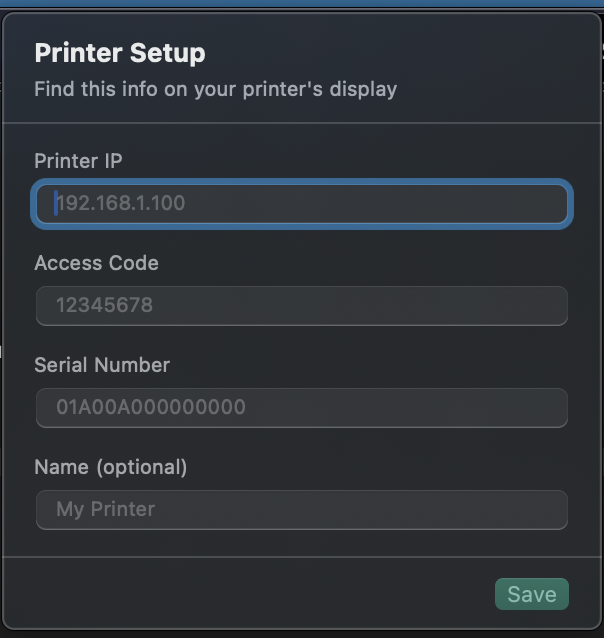

# BambuScheduler

[English](README.md) · **Português (Brasil)**

Um pequeno app da barra de menus do macOS que agenda e monitora impressões na sua impressora Bambu Lab pela rede local. **Sem conta na nuvem, sem assinatura** — ele fala direto com a sua impressora em casa.

> Quer começar uma impressão às 2h da manhã para aproveitar a energia mais barata, ou já deixar os trabalhos de amanhã na fila hoje à noite? Solte um arquivo, escolha um horário, pronto.

---

## O que ele faz

- 🕒 **Agenda impressões** para uma data e hora específicas
- 🖨️ **Status ao vivo** — estado da impressora, temperatura do bico/mesa e progresso, direto na barra de menus
- ⏯️ **Controle** — pausar, retomar ou cancelar uma impressão
- 🎨 **Suporte a AMS** — escolha em qual compartimento de filamento imprimir
- 👀 **Pré-visualização** — clique em um trabalho agendado para ver o modelo
- 🔒 **100% local** — sem a nuvem da Bambu, sem login

---

## Antes de começar, você vai precisar de

- Um Mac com **macOS 14 (Sonoma) ou mais recente**
- Uma **impressora Bambu Lab** (testado na A1; funciona com X1C, P1S e outras) conectada à **mesma rede Wi‑Fi** que o seu Mac

É só isso. Você **não** precisa instalar Python nem nada mais — o app é autossuficiente.

---

## Passo 1 — Baixar e instalar

1. Acesse a **[página de Releases](https://github.com/brunomunizaf/BambuScheduler/releases/latest)** e baixe o **`BambuScheduler.zip`**.
2. Dê dois cliques no zip para descompactar. Você vai obter o **`BambuScheduler.app`**.
3. Arraste o **`BambuScheduler.app`** para a sua pasta **Aplicativos**.

---

## Passo 2 — Abrir pela primeira vez (passando pela segurança do macOS)

O BambuScheduler é um app gratuito que não é distribuído pela App Store da Apple, então na primeira vez que você abrir, o macOS vai parar e avisar. **Isso é normal.** Veja como permitir — você faz isso só uma vez.

1. Abra o app. Você vai ver esta mensagem. Clique em **Concluir** — **_não_ clique em "Mover para o Lixo".**

   

2. Abra **Ajustes do Sistema → Privacidade e Segurança** e role até a seção **Segurança**. Você vai ver uma linha dizendo que o BambuScheduler foi bloqueado. Clique em **Abrir Mesmo Assim**.

   

3. Confirme com **Abrir Mesmo Assim** mais uma vez e autentique com o Touch ID ou a senha do seu Mac.

Depois disso, o BambuScheduler abre normalmente todas as vezes, e o ícone dele (um pequeno cubo) aparece na barra de menus no topo da tela.

> **Prefere o terminal?** Você pode pular os cliques rodando isto uma vez e depois abrindo o app:
> ```bash
> xattr -d com.apple.quarantine /Applications/BambuScheduler.app
> ```

---

## Passo 3 — Preparar a sua impressora

O BambuScheduler controla a impressora diretamente pela rede, então dois ajustes precisam estar **ligados** na tela sensível ao toque da própria impressora. Os dois ficam no mesmo menu.

1. **Modo Somente LAN (LAN Only Mode)** — `Ajustes › Modo Somente LAN › LIGADO`
   Isso permite que a impressora aceite comandos do seu Mac em vez de só da nuvem Bambu. **Sem isso, o app não consegue alcançar a sua impressora.**

2. **Modo Desenvolvedor (Developer Mode)** — `Ajustes › Modo Somente LAN › Modo Desenvolvedor › LIGADO`
   Sem isso, a impressora rejeita os comandos de impressão.

Enquanto estiver nessa tela, anote estas três informações — você vai digitá-las no app em seguida:

| O quê | Onde encontrar na impressora |
|---|---|
| **Endereço IP** | `Ajustes › Modo Somente LAN` |
| **Código de Acesso** (8 dígitos) | `Ajustes › Modo Somente LAN` |
| **Número de Série** | `Ajustes › Informações do Dispositivo` (ou o adesivo na impressora) |

---

## Passo 4 — Conectar o app à sua impressora

Clique no **ícone de cubo** na barra de menus e abra a tela de configuração. Digite o **Endereço IP**, o **Código de Acesso** e o **Número de Série** do passo anterior e salve.



> O código de acesso pode **mudar** se você desligar e ligar o Modo Somente LAN, ou depois de uma atualização de firmware. Se o app disser que não consegue conectar, confira esse número primeiro — veja [Solução de problemas](#solução-de-problemas).

Suas configurações ficam salvas no seu Mac em `~/Library/Application Support/BambuScheduler/config.json`.

---

## Passo 5 — Imprimir ou agendar uma impressão

Clique no ícone de cubo e escolha **Abrir Web UI** (ou abra `http://localhost:8080` no seu navegador). É aqui que você envia os arquivos.

1. **Solte um arquivo `.3mf` fatiado** na área de upload (ou clique para procurar).
   - O arquivo **precisa ser fatiado no Bambu Studio antes**: `Arquivo › Exportar › Exportar arquivo da placa fatiado (.3mf)`. Um arquivo de modelo simples não funciona.
2. **Escolha o compartimento do AMS** com o filamento que você quer (ou desligue "Usar AMS" para imprimir de um carretel externo).
3. Depois, escolha entre:
   - **Imprimir agora** — começa na hora, ou
   - **Agendar** — escolha uma data e hora, e o BambuScheduler inicia para você.

As impressões agendadas aparecem em **Próximas impressões**. **Clique em qualquer trabalho agendado para pré-visualizar o modelo.**


### ⚠️ Importante: mantenha o seu Mac acordado

Uma impressão agendada só dispara se o seu Mac estiver acordado para enviá-la. Então, enquanto houver uma impressão agendada:

- **Mantenha o Mac ligado na tomada**
- **Mantenha a tampa aberta** (fechá-la coloca o Mac para dormir)
- A **tela escurecer não tem problema** — o BambuScheduler mantém o sistema acordado mesmo com o monitor desligado.

O app lembra você disso sempre que houver algo agendado.

---

## A barra de menus

Clique no ícone de cubo a qualquer momento para uma olhada rápida — status da impressora, temperaturas, progresso ao vivo e suas impressões agendadas. Daqui você também pode abrir a web UI ou encerrar o app.


---

## Solução de problemas

**"Não conecta na minha impressora" / o status fica em branco**
1. Verifique se a impressora e o Mac estão na **mesma rede**.
2. Confirme que o **Modo Somente LAN** e o **Modo Desenvolvedor** estão **LIGADOS** (Passo 3).
3. Confira novamente o **Código de Acesso** — é o culpado mais comum. As impressoras Bambu mudam esse código quando o Modo Somente LAN é desligado/ligado ou depois de uma atualização de firmware. Leia o código atual de 8 dígitos em `Ajustes › Modo Somente LAN` e atualize-o na tela de configuração do app.
4. Confira se há erros de digitação no **Endereço IP** e no **Número de Série**.

**"Meu arquivo foi rejeitado"**
O `.3mf` precisa ser **fatiado** no Bambu Studio (`Exportar arquivo da placa fatiado`). Um modelo não fatiado não tem instruções de impressão e será recusado.

**"Minha impressão agendada não começou"**
O Mac provavelmente estava dormindo. Mantenha-o na tomada com a tampa aberta até a impressão começar (veja a nota sobre manter acordado acima).

---

## Para desenvolvedores

<details>
<summary>Compilar do código-fonte, arquitetura e API</summary>

### Compilar do código-fonte

Só é necessário se você quiser desenvolver ou compilar o app por conta própria em vez de baixar uma release.

```bash
git clone https://github.com/brunomunizaf/BambuScheduler.git
cd BambuScheduler
python3 -m venv .venv
source .venv/bin/activate
pip install -r requirements.txt
./scripts/build_release.sh
open release/BambuScheduler.app
```

O script empacota o backend em Python com o PyInstaller, compila o app Swift da barra de menus, monta o `release/BambuScheduler.app`, faz a assinatura de código ad‑hoc e o compacta em `release/BambuScheduler.zip`.

Para iteração rápida só no backend sem recompilar o app inteiro:

```bash
python3 web.py   # serve a web UI em http://localhost:8080
```

### Como funciona

- **MQTT** (porta 8883) — consulta o status da impressora e envia comandos de impressão
- **FTPS** (porta 990) — envia arquivos `.3mf` para o armazenamento interno da impressora
- **Flask** (porta 8080) — serve a web UI e a API, empacotado no app com o PyInstaller
- **SwiftUI MenuBarExtra** — widget nativo da barra de menus do macOS; inicia o backend empacotado na abertura e o encerra ao sair
- **APScheduler** — agendamento de impressões por horário, com persistência entre reinicializações

### API HTTP

| Endpoint | Método | Descrição |
|---|---|---|
| `/api/status` | GET | Status da impressora, temperaturas, progresso |
| `/api/jobs` | GET | Lista os trabalhos de impressão agendados |
| `/api/thumbnail?file=<nome>` | GET | Render embutido da placa de um `.3mf` enviado |
| `/api/upload` | POST | Envia um arquivo `.3mf` |
| `/api/print` | POST | Inicia ou agenda uma impressão |
| `/api/stop` | POST | Cancela a impressão atual |
| `/api/pause` | POST | Pausa a impressão atual |
| `/api/resume` | POST | Retoma a impressão pausada |
| `/api/cancel-job` | POST | Cancela um trabalho agendado |

### Rodar o backend como um serviço de login (opcional)

Para rodar o backend Flask como um serviço em segundo plano persistente em vez de pelo app da barra de menus (por exemplo, para uso headless), o `com.bambu.scheduler.plist` é fornecido como um modelo de launchd. Edite os caminhos dentro dele para o seu setup e depois:

```bash
cp com.bambu.scheduler.plist ~/Library/LaunchAgents/
launchctl load ~/Library/LaunchAgents/com.bambu.scheduler.plist
```

</details>

---

## Licença

MIT
